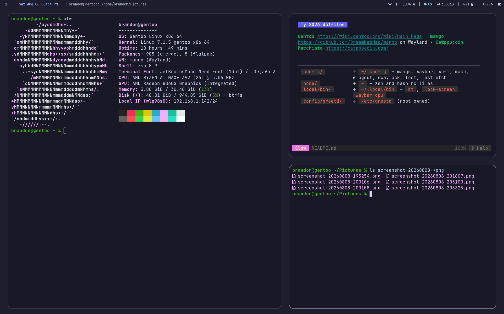
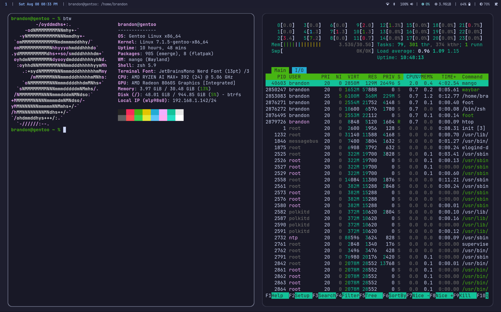
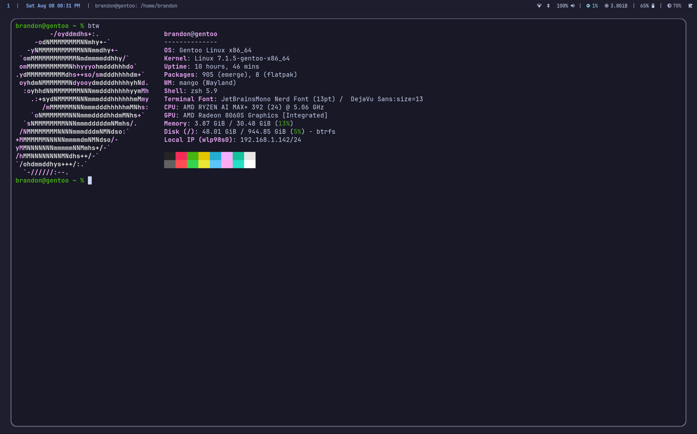

# my 2026 dotfiles

[Gentoo](https://wiki.gentoo.org/wiki/Main_Page) · [mango](https://github.com/DreamMaoMao/mango) on Wayland · [Catppuccin Macchiato](https://catppuccin.com/)

| | |
|---|---|
| `config/` | → `~/.config` — mango, waybar, wofi, mako, wlogout, swaylock, foot, fastfetch |
| `home/` | → `~` — zsh and bash rc files |
| `local/bin/` | → `~/.local/bin` — `bt`, `lock-screen`, `waybar-cpu` |
| `config/greetd/` | → `/etc/greetd` (root-owned) |

# images

# extra notes
- expected idle ram usage on my setup is around ~1 gig. ignore levels shown in screenshots, they aren't accurate.
